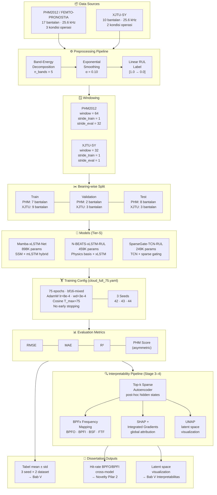
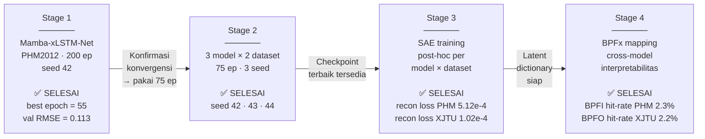
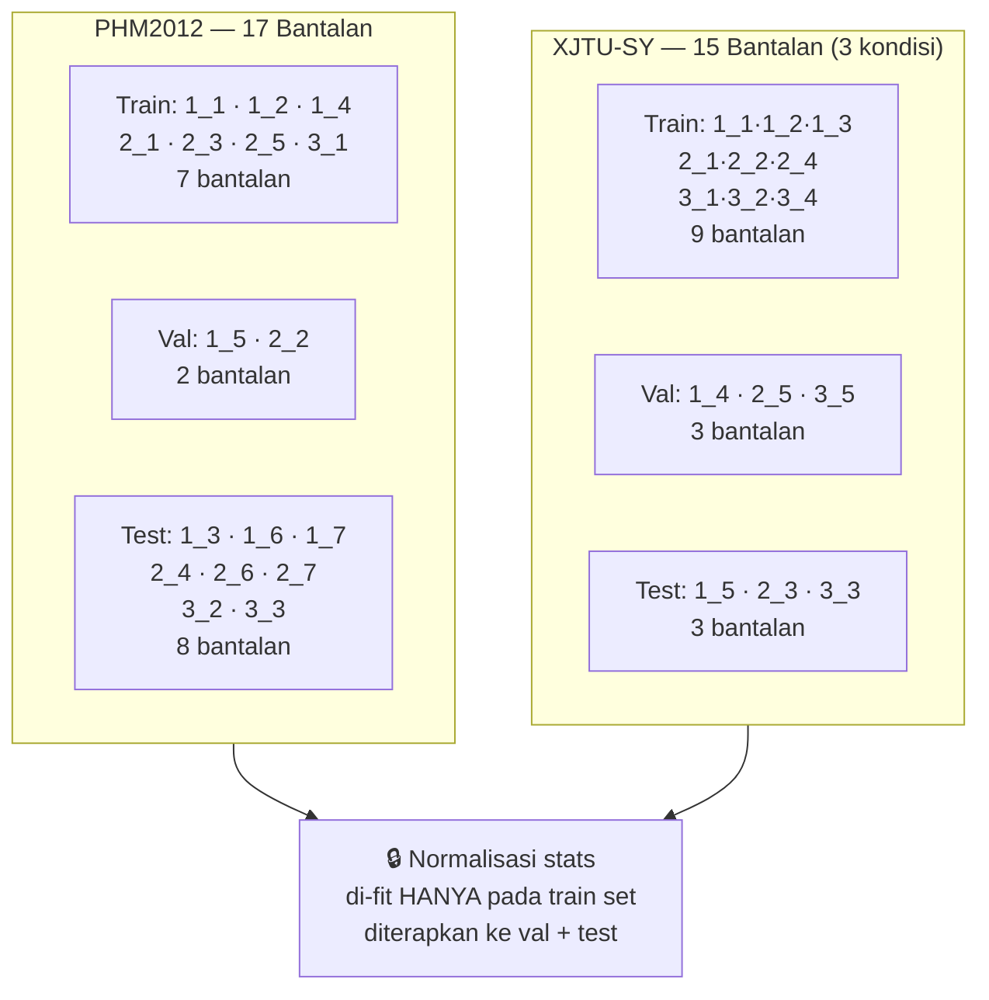
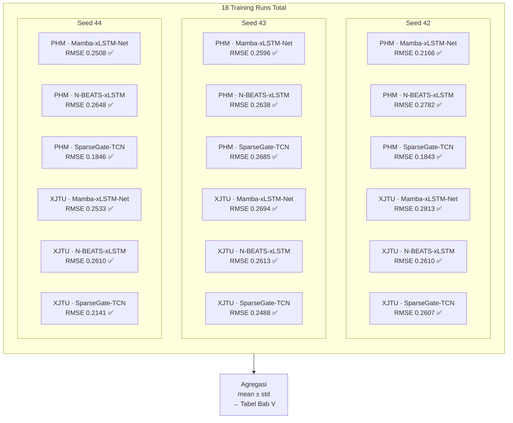
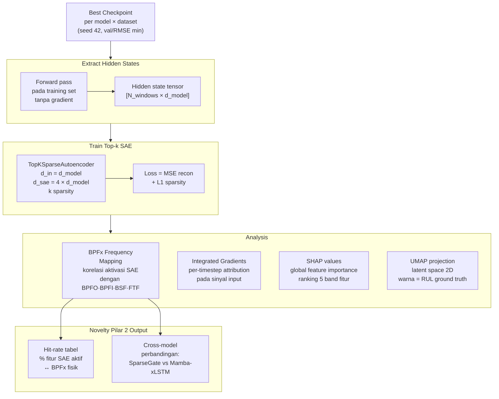

# Research Design Chart

## Overview Diagram

```mermaid
flowchart TD
    subgraph INPUT["📦 Data Sources"]
        PHM["PHM2012 / FEMTO-PRONOSTIA\n17 bantalan · 25.6 kHz\n3 kondisi operasi"]
        XJTU["XJTU-SY\n10 bantalan · 25.6 kHz\n2 kondisi operasi"]
    end

    subgraph PREPROC["⚙️ Preprocessing Pipeline"]
        direction LR
        BAND["Band-Energy\nDecomposition\nn_bands = 5"]
        SMOOTH["Exponential\nSmoothing\nα = 0.10"]
        LABEL["Linear RUL\nLabel\n[1.0 → 0.0]"]
        BAND --> SMOOTH --> LABEL
    end

    subgraph WINDOW["🪟 Windowing"]
        WP["PHM2012\nwindow = 64\nstride_train = 1\nstride_eval = 32"]
        WX["XJTU-SY\nwindow = 32\nstride_train = 1\nstride_eval = 1"]
    end

    subgraph SPLIT["✂️ Bearing-wise Split"]
        direction LR
        TR["Train\nPHM: 7 bantalan\nXJTU: 9 bantalan"]
        VAL["Validation\nPHM: 2 bantalan\nXJTU: 3 bantalan"]
        TE["Test\nPHM: 8 bantalan\nXJTU: 3 bantalan"]
        TR --- VAL --- TE
    end

    subgraph MODELS["🧠 Models (Tier-S)"]
        direction TB
        M1["Mamba-xLSTM-Net\n898K params\nSSM + mLSTM hybrid"]
        M2["N-BEATS-xLSTM-RUL\n459K params\nPhysics basis + xLSTM"]
        M3["SparseGate-TCN-RUL\n249K params\nTCN + sparse gating"]
    end

    subgraph TRAIN["🏋️ Training Config (cloud_full_75.yaml)"]
        direction LR
        TC["75 epochs · bf16-mixed\nAdamW lr=8e-4 · wd=3e-4\nCosine T_max=75\nNo early stopping"]
        SEEDS["3 Seeds\n42 · 43 · 44"]
        TC --- SEEDS
    end

    subgraph EVAL["📊 Evaluation Metrics"]
        direction LR
        E1["RMSE"]
        E2["MAE"]
        E3["R²"]
        E4["PHM Score\n(asymmetric)"]
        E1 --- E2 --- E3 --- E4
    end

    subgraph INTERP["🔍 Interpretability Pipeline (Stage 3–4)"]
        direction TB
        SAE["Top-k Sparse\nAutoencoder\npost-hoc hidden states"]
        BPFX["BPFx Frequency\nMapping\nBPFO · BPFI · BSF · FTF"]
        SHAP["SHAP +\nIntegrated Gradients\nglobal attribution"]
        UMAP["UMAP\nlatent space\nvisualization"]
        SAE --> BPFX
        SAE --> SHAP
        SAE --> UMAP
    end

    subgraph OUTPUT["📄 Dissertation Outputs"]
        O1["Tabel mean ± std\n3 seed × 2 dataset\n→ Bab V"]
        O2["Hit-rate BPFO/BPFI\ncross-model\n→ Novelty Pilar 2"]
        O3["Latent space\nvisualization\n→ Bab V Interpretabilitas"]
    end

    PHM --> PREPROC
    XJTU --> PREPROC
    PREPROC --> WINDOW
    WINDOW --> SPLIT
    SPLIT --> MODELS
    MODELS --> TRAIN
    TRAIN --> EVAL
    EVAL --> INTERP
    EVAL --> O1
    INTERP --> O2
    INTERP --> O3
```

---

## Stage Progression

```mermaid
flowchart LR
    S1["Stage 1\n──────\nMamba-xLSTM-Net\nPHM2012 · 200 ep\nseed 42\n\n✅ SELESAI\nbest epoch = 55\nval RMSE = 0.113"]
    S2["Stage 2\n──────\n3 model × 2 dataset\n75 ep · 3 seed\n\n✅ SELESAI\nseed 42 · 43 · 44"]
    S3["Stage 3\n──────\nSAE training\npost-hoc per\nmodel × dataset\n\n✅ SELESAI\nrecon loss PHM 5.12e-4\nrecon loss XJTU 1.02e-4"]
    S4["Stage 4\n──────\nBPFx mapping\ncross-model\ninterpretabilitas\n\n✅ SELESAI\nBPFI hit-rate PHM 2.3%\nBPFO hit-rate XJTU 2.2%"]

    S1 -->|"Konfirmasi\nkonvergensi\n→ pakai 75 ep"| S2
    S2 -->|"Checkpoint\nterbaik tersedia"| S3
    S3 -->|"Latent\ndictionary\nsiap"| S4
```

---

## Data Split Detail

```mermaid
flowchart TD
    subgraph PHM["PHM2012 — 17 Bantalan"]
        direction LR
        P_TR["Train: 1_1 · 1_2 · 1_4\n       2_1 · 2_3 · 2_5 · 3_1\n       7 bantalan"]
        P_V["Val: 1_5 · 2_2\n     2 bantalan"]
        P_TE["Test: 1_3 · 1_6 · 1_7\n      2_4 · 2_6 · 2_7\n      3_2 · 3_3\n      8 bantalan"]
    end

    subgraph XJTU["XJTU-SY — 15 Bantalan (3 kondisi)"]
        direction LR
        X_TR["Train: 1_1·1_2·1_3\n       2_1·2_2·2_4\n       3_1·3_2·3_4\n       9 bantalan"]
        X_V["Val: 1_4 · 2_5 · 3_5\n     3 bantalan"]
        X_TE["Test: 1_5 · 2_3 · 3_3\n      3 bantalan"]
    end

    NORM["🔒 Normalisasi stats\ndi-fit HANYA pada train set\nditerapkan ke val + test"]

    PHM --> NORM
    XJTU --> NORM
```

---

## Multi-Seed Experiment Matrix

```mermaid
flowchart TD
    subgraph MATRIX["18 Training Runs Total"]
        direction TB
        subgraph S42["Seed 42"]
            A1["PHM · Mamba-xLSTM-Net\nRMSE 0.2166 ✅"]
            A2["PHM · N-BEATS-xLSTM\nRMSE 0.2782 ✅"]
            A3["PHM · SparseGate-TCN\nRMSE 0.1843 ✅"]
            A4["XJTU · Mamba-xLSTM-Net\nRMSE 0.2813 ✅"]
            A5["XJTU · N-BEATS-xLSTM\nRMSE 0.2610 ✅"]
            A6["XJTU · SparseGate-TCN\nRMSE 0.2607 ✅"]
        end
        subgraph S43["Seed 43"]
            B1["PHM · Mamba-xLSTM-Net\nRMSE 0.2596 ✅"]
            B2["PHM · N-BEATS-xLSTM\nRMSE 0.2638 ✅"]
            B3["PHM · SparseGate-TCN\nRMSE 0.2685 ✅"]
            B4["XJTU · Mamba-xLSTM-Net\nRMSE 0.2694 ✅"]
            B5["XJTU · N-BEATS-xLSTM\nRMSE 0.2613 ✅"]
            B6["XJTU · SparseGate-TCN\nRMSE 0.2488 ✅"]
        end
        subgraph S44["Seed 44"]
            C1["PHM · Mamba-xLSTM-Net\nRMSE 0.2508 ✅"]
            C2["PHM · N-BEATS-xLSTM\nRMSE 0.2648 ✅"]
            C3["PHM · SparseGate-TCN\nRMSE 0.1846 ✅"]
            C4["XJTU · Mamba-xLSTM-Net\nRMSE 0.2533 ✅"]
            C5["XJTU · N-BEATS-xLSTM\nRMSE 0.2610 ✅"]
            C6["XJTU · SparseGate-TCN\nRMSE 0.2141 ✅"]
        end
    end

    MATRIX --> AGG["Agregasi\nmean ± std\n→ Tabel Bab V"]
```

---

## Interpretability Pipeline (Stage 3–4)

```mermaid
flowchart TD
    CKPT["Best Checkpoint\nper model × dataset\n(seed 42, val/RMSE min)"]

    subgraph EXTRACT["Extract Hidden States"]
        FWD["Forward pass\npada training set\ntanpa gradient"]
        HIDDEN["Hidden state tensor\n[N_windows × d_model]"]
        FWD --> HIDDEN
    end

    subgraph SAE_TRAIN["Train Top-k SAE"]
        SAE_ARCH["TopKSparseAutoencoder\nd_in = d_model\nd_sae = 4 × d_model\nk sparsity"]
        SAE_LOSS["Loss = MSE recon\n+ L1 sparsity"]
        SAE_ARCH --> SAE_LOSS
    end

    subgraph ANALYSIS["Analysis"]
        direction TB
        FREQ["BPFx Frequency\nMapping\nkorelasi aktivasi SAE\ndengan BPFO·BPFI·BSF·FTF"]
        IG["Integrated Gradients\nper-timestep attribution\npada sinyal input"]
        SHAP2["SHAP values\nglobal feature importance\nranking 5 band fitur"]
        UMAP2["UMAP projection\nlatent space 2D\nwarna = RUL ground truth"]
    end

    subgraph CLAIM["Novelty Pilar 2 Output"]
        HIT["Hit-rate tabel\n% fitur SAE aktif\n↔ BPFx fisik"]
        CROSS["Cross-model\nperbandingan:\nSparseGate vs Mamba-xLSTM"]
    end

    CKPT --> EXTRACT
    EXTRACT --> SAE_TRAIN
    SAE_TRAIN --> ANALYSIS
    FREQ --> HIT
    FREQ --> CROSS
```
